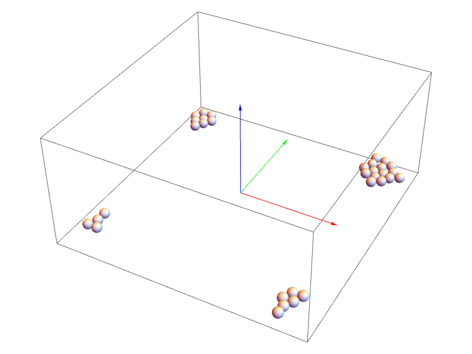

# Game Physics in One Weekend

## Changes
* CMake project & build support
* default math interface replaced with Eigen
* removed rendering backend
* more to come ...

## References
 * [Game Physics in One Weekend by Gregory Hodges](https://gamephysicsweekend.github.io/)
